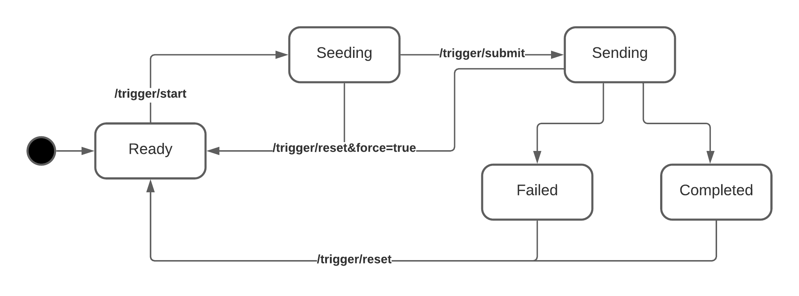

# LWGS Person Data Processor Service

Reference implementation of wrapping the lwgs-person-data-processor library. Service allows to process and seed
personData to the central search index, part of Landesweite Grundstückssuche (LWGS). Data is consumed via
a RESTfull interface, and passed on through Sedex after successful processing. The service allows either full or 
partial syncs.

## System Architecture

## Seeding Flows

### Full Sync

### Components Description

#### SedexFileWriterService

The SedexFileWriter service will receive the JobCollectedPersonData objects from the
lwgs.sedex.outbox and create a zip file as Sedex payload. Each zip file will contain `[1..n]` zip
entries of GBPersonEvents.

##### Relevant configuration parameters

<dl>
    <dt><strong>lwgs.searchindex.client.sedex.base-path</strong></dt>
        <dd>Sedex base path. Default is /tmp/sedex</dd>
    <dt><strong>lwgs.searchindex.client.sedex.receipt-path</strong></dt>
        <dd>Sedex receipt path. Default is receipts</dd>
    <dt><strong>lwgs.searchindex.client.sedex.outbox-path</strong></dt>
        <dd>Sedex outbox path. Default is outbox</dd>
    <dt><strong>lwgs.searchindex.client.sedex.create-directories</strong></dt>
        <dd>Controls automatic creation of Sedex directories. Default is false.</dd>
    <dt><strong>lwgs.searchindex.client.sedex.sender-id</strong></dt>
        <dd>Configures the senderId of the outgoing sedex message.</dd>
    <dt><strong>lwgs.searchindex.client.sedex.recipient-id</strong></dt>
        <dd>Configures the recipientId of the outgoing sedex message.</dd>
    <dt><strong>lwgs.searchindex.client.sedex.message.type</strong></dt>
        <dd>Configures the messageType of the outgoing sedex message.</dd>
    <dt><strong>lwgs.searchindex.client.sedex.message.class</strong></dt>
        <dd>Configures the messageClass of the outgoing sedex message.</dd>
    <dt><strong>lwgs.searchindex.client.sedex.file-writer.failure.throttling.base</strong></dt>
        <dd>Base for throttling interval in case of errors. Throttling interval doubles on each failed retry (until _max_ is reached). Default is set to 1'000 ms.</dd>
    <dt><strong>lwgs.searchindex.client.sedex.file-writer.failure.throttling.max</strong></dt>
        <dd>Controls max throttling interval in ms. Default is set to 3'600'000 ms (1h).</dd>
    <dt><strong>lwgs.searchindex.client.sedex.file-writer.fixed-delay</strong></dt>
        <dd>Execution interval of the SedexFileWriterService in ms. Default is set to 1'000 ms.</dd>
</dl>

##### Error Handling and resolution

If the sedex/outbox folder is not accessible or in case of any other IOException the SedexFileWriter
service will requeue the message and continue processing.

In cases of an exception the SedexFileWriter service will throttle processing until it successfully
processed a message.

Throttling can be configured by the following configuration keys:

`lwgs.searchindex.client.sedex.file-writer.failure.throttling.base` (default: 1000 ms)

`lwgs.searchindex.client.sedex.file-writer.failure.throttling.max` (default: 3600000 ms)

The throttling interval is calculated as following:

`waitingTime = min(2^retryCount * throttlingBase, throttlingMax)`

The issues need to be resolved manually by the administrator.

###### Proposed error resolution activities

- Check if Sedex outbox exists
- Check if Sedex outbox is accessible for search-index-client-service
- Check if enough disk space is available for volume containing Sedex outbox
- Check user quotas for volume

# Reference Documentation

For further reference, please consider the following sections:

* [Official Apache Maven documentation](https://maven.apache.org/guides/index.html)
* [Spring Boot Maven Plugin Reference Guide](https://docs.spring.io/spring-boot/docs/2.4.1/maven-plugin/reference/html/)
* [Create an OCI image](https://docs.spring.io/spring-boot/docs/2.4.1/maven-plugin/reference/html/#build-image)
* [Rest Repositories](https://docs.spring.io/spring-boot/docs/2.4.1/reference/htmlsingle/#howto-use-exposing-spring-data-repositories-rest-endpoint)
* [Spring Security](https://docs.spring.io/spring-boot/docs/2.4.1/reference/htmlsingle/#boot-features-security)
* [Spring Boot Actuator](https://docs.spring.io/spring-boot/docs/2.4.1/reference/htmlsingle/#production-ready)
* [Spring Batch](https://docs.spring.io/spring-boot/docs/2.4.1/reference/htmlsingle/#howto-batch-applications)
* [Spring Data JPA](https://docs.spring.io/spring-boot/docs/2.4.1/reference/htmlsingle/#boot-features-jpa-and-spring-data)
* [Spring Boot DevTools](https://docs.spring.io/spring-boot/docs/2.4.1/reference/htmlsingle/#using-boot-devtools)

### Guides

The following guides illustrate how to use some features concretely:

* [Accessing JPA Data with REST](https://spring.io/guides/gs/accessing-data-rest/)
* [Accessing Neo4j Data with REST](https://spring.io/guides/gs/accessing-neo4j-data-rest/)
* [Accessing MongoDB Data with REST](https://spring.io/guides/gs/accessing-mongodb-data-rest/)
* [Securing a Web Application](https://spring.io/guides/gs/securing-web/)
* [Spring Boot and OAuth2](https://spring.io/guides/tutorials/spring-boot-oauth2/)
* [Authenticating a User with LDAP](https://spring.io/guides/gs/authenticating-ldap/)
* [Building a RESTful Web Service with Spring Boot Actuator](https://spring.io/guides/gs/actuator-service/)
* [Creating a Batch Service](https://spring.io/guides/gs/batch-processing/)
* [Accessing Data with JPA](https://spring.io/guides/gs/accessing-data-jpa/)

